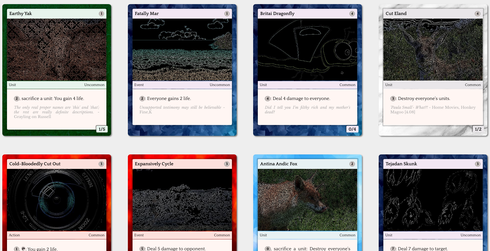

# the infinite CCG

this is the start of an attempt to create an infinite collectible card game.

right now there is only the card generator. you can run it by:

    # install requirements
    pip install -r requirements.txt

    # go to <https://pixabay.com/api/docs/>
    # get an api key
    # set it in `config.py` (refer to `example_config.py`)

    # run the server
    python server.py

    # go to `localhost:5002`

this uses the pixabay image API which is a great free service but has a much more limited selection than google's now deprecated image API. so not all of the cards will have images generated for them.

---

# Examples

